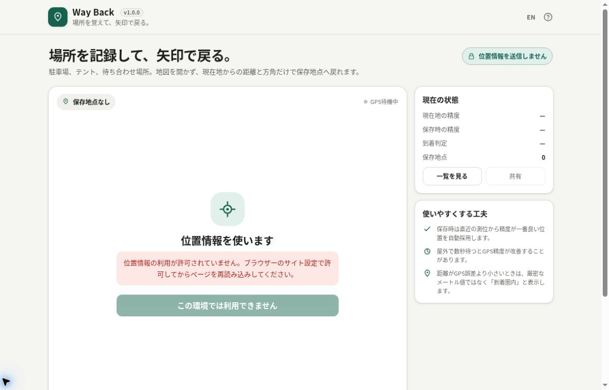

# Way Back

[](https://github.com/ttomohisa/htmlapps-way-back/actions/workflows/deploy-pages.yml)
[](LICENSE)
[](https://ttomohisa.github.io/htmlapps-way-back/)

[English README](README.md)

Way Back は、現在地を保存して、地図を開かず **大きな矢印と直線距離だけで戻る**ためのスマホ向け単一HTMLアプリです。アカウントやインストールは不要です。



## 🚀 デモ

### [GitHub PagesでWay Backを開く](https://ttomohisa.github.io/htmlapps-way-back/)

**「位置情報を開始」**を押したときだけ位置情報を要求します。現在地はページ内で処理され、明示的に保存した地点だけがこのブラウザーのLocalStorageに保存されます。アプリから保存座標をサーバーへアップロードしません。


## 主な機能

- 駐車位置、テント、待ち合わせ場所、入口などを複数保存
- 選択した保存地点までの**大きな矢印と直線距離**を表示
- 端末・ブラウザーが対応している場合はコンパスに合わせて矢印を追従
- 方位センサーが使えない場合も**北基準の方角＋距離**で利用可能
- 保存時に直近のGPS測位から**最も精度の良い位置を自動採用**
- 現在地と保存時それぞれのGPS精度を表示
- GPS誤差を考慮した**到着圏内判定**
- 保存地点の案内・共有・削除
- Web Share対応、非対応時はクリップボードへ座標をコピー
- 案内中の画面スリープ防止（対応環境）
- 1つのHTML内で日本語・英語を切り替え
- スマホではボトムシート中心のネイティブアプリ風UI
- 外部ランタイムライブラリなし
- 解析・テレメトリ・アカウント・クラウド保存なし

## すぐに使う

### Webで使う

スマホで [GitHub Pagesのデモ](https://ttomohisa.github.io/htmlapps-way-back/) を開き、**「位置情報を開始」**を押して位置情報を許可します。

1. GPS精度が表示されるまで待ちます。
2. **「場所を保存」**から現在地に名前を付けます。
3. 保存地点から移動します。
4. **「保存地点」**から戻りたい地点を選びます。
5. 矢印と距離を見ながら戻ります。

屋外で数秒待ってから保存すると、GPS精度が改善することがあります。

### ローカルHTMLについて

`dist/index.html` は外部アセット不要の単一HTMLとして開けます。ただし、位置情報は通常Secure Contextが必要で、スマホブラウザーによっては `file://` で開いたHTMLから位置情報を取得できません。

**実際の案内用途ではHTTPSでの公開を推奨・サポート対象**としています。GitHub PagesやBrowser Kittyのような静的HTTPS配信で十分で、バックエンドAPIは不要です。

### 単一HTMLをビルドする

1. このリポジトリをダウンロードまたはクローンします。
2. Windowsで `build-standalone.bat` を実行します。
3. 以下が生成されます。
   - `dist/index.html`
   - `dist/index.self-extract.html`
4. リポジトリチェックで、外部アセットやランタイム通信が追加されていないことを検査します。

リポジトリのビルドにPython、Node.js、ローカルWebサーバーは不要です。Windows PowerShellを使用します。

## GPSの誤差をどう扱うか

Way Backでは、GPSの値を必要以上に正確に見せないことを重視しています。

### 保存時は「直近で一番良い測位」を採用

位置情報の直近サンプルを短時間だけ保持し、場所を保存したときは**直近15秒で報告精度が最も良かった位置**を自動採用します。保存ボタンを押した瞬間の値をそのまま使うより、GPSの揺れの影響を減らせます。

### GPS精度を加味した到着圏内

戻るときは、現在地の精度と保存時の精度を組み合わせて到着判定の半径を調整します。残り距離がその範囲に入ると、細かいメートル値を過信させるのではなく**「到着圏内」**として表示します。

あくまで日常用途の補助ツールであり、測量や安全に関わるナビゲーションの代替ではありません。

## コンパスについて

端末の方位情報が取得できる場合は、スマホ上端の向きに合わせて矢印を回転します。

方位情報が取得できない・権限を拒否した・非対応の場合でも、Way Back自体は利用できます。その場合は北を基準にした方角と距離を表示します。

コンパスは端末やブラウザーによる差があり、金属、車体、電子機器など周囲の磁気環境でも誤差が出ます。

## GitHub Pagesで公開する

このリポジトリには、単一HTMLをビルドしてGitHub Pagesへ公開するワークフローが含まれています。

1. リポジトリ名を `htmlapps-way-back` としてGitHubへプッシュします。
2. **Settings → Pages → Build and deployment → Source** で **GitHub Actions** を選択します。
3. `main` へプッシュするか、ActionsからPagesデプロイを手動実行します。
4. 公開後、スマホで `https://ttomohisa.github.io/htmlapps-way-back/` を開きます。

位置情報・方位センサーは多くのブラウザーでSecure Contextを要求するため、HTTPSで公開することが重要です。

## 開発とビルド

```text
.
├─ src/index.template.html       # アプリ本体
├─ app.config.json               # アプリ・ビルド設定
├─ dependencies.json             # 内包依存（現在はなし）
├─ build-standalone.bat          # Windows用ビルド入口
├─ build-standalone.ps1          # 単一HTMLビルダー
├─ scripts/check-repository.ps1  # ビルド＋アプリ固有チェック
├─ dist/index.html               # 通常の単一HTML版
└─ dist/index.self-extract.html  # gzip自己展開版
```

生成HTMLは `connect-src 'none'` を含む制限の強いContent Security Policyを維持し、外部サーバーからランタイムのJavaScript、CSS、画像、フォント、iframeを読み込みません。

## プライバシー

- 現在地は、ユーザーが保存操作をしない限りメモリ内だけで扱います。
- 保存地点の座標・名前・保存日時・GPS精度はLocalStorageに保存します。
- アプリ自身は位置情報をサーバーへ送信しません。
- 保存地点の共有はユーザーが**「共有」**を押した場合だけ実行します。
- ブラウザーやOSの測位サービスは、端末設定に応じてネットワーク補助測位を利用する場合があります。これはWay Backから制御するものではありません。

## 制限事項

- 屋内、地下、高層ビル街、木々の多い場所などではGPS精度が低下する場合があります。
- 表示する距離は直線距離で、徒歩・車の経路距離ではありません。
- 方位センサーは端末・ブラウザーによって非対応または個別の権限が必要な場合があります。
- コンパスは周囲の金属や電子機器の影響を受けます。
- `file://` では画面を開けても位置情報や方位情報が取得できない場合があります。
- 緊急時、航空、船舶、登山安全など、安全性が重要なナビゲーションには使用しないでください。

## 使用ライブラリ

Way Backは現在、ブラウザー標準APIだけで実装しており、外部ランタイムライブラリを使用していません。

依存関係の記録は [THIRD_PARTY_NOTICES.md](THIRD_PARTY_NOTICES.md) を確認してください。

## コントリビューション

バグ報告や機能提案はIssueからお願いします。開発への参加方法は [CONTRIBUTING.md](CONTRIBUTING.md) を確認してください。

## ライセンス

Copyright © 2026 ttomohisa

このプロジェクトは [MIT License](LICENSE) で公開されています。
