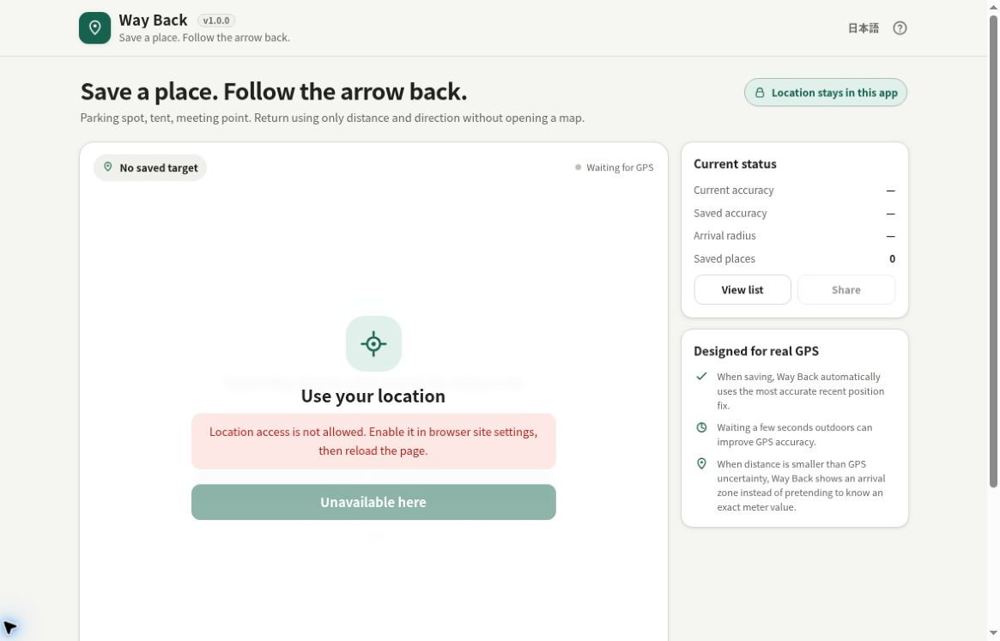

# Way Back

[](https://github.com/ttomohisa/htmlapps-way-back/actions/workflows/deploy-pages.yml)
[](LICENSE)
[](https://ttomohisa.github.io/htmlapps-way-back/)

[日本語版 README](README.ja.md)

Way Back is a privacy-friendly, single-HTML smartphone tool for saving a place and finding your way back with a large arrow and straight-line distance — no map and no account required.



## 🚀 Live demo

### [Open Way Back on GitHub Pages](https://ttomohisa.github.io/htmlapps-way-back/)

Way Back requests your location only after you tap **Start location**. Current coordinates are processed in the page, and only places you explicitly save are stored in this browser's LocalStorage. The app does not upload saved coordinates to an application server.


## Features

- Save multiple named places such as a parking spot, tent, meeting point, or entrance
- Large arrow and straight-line distance to the selected saved place
- Device-compass guidance when browser/device heading is available
- North-referenced bearing fallback when compass access is unavailable or denied
- Automatic **best recent GPS fix** selection when saving a place
- Current and saved GPS-accuracy display
- Accuracy-aware **arrival zone** instead of pretending GPS is exact to the meter
- Saved-place list with guide, share, and delete actions
- Web Share support with clipboard fallback
- Optional Screen Wake Lock while guiding
- Japanese and English UI in the same HTML
- Smartphone-first responsive UI with bottom-sheet dialogs
- No third-party runtime library
- No analytics, telemetry, account, or cloud storage

## Quick start

### Use the web demo

Open the [GitHub Pages demo](https://ttomohisa.github.io/htmlapps-way-back/) on a smartphone, tap **Start location**, and allow location access.

1. Wait until the current GPS accuracy appears.
2. Tap **Save place** and give the point a name.
3. Walk away from the saved point.
4. Select the point from **Saved places**.
5. Follow the arrow and distance back.

For best results, use the app outdoors and wait a few seconds before saving so the browser can obtain a better location fix.

### About local HTML files

`dist/index.html` is a complete single HTML file and opens without external assets. However, geolocation is normally restricted to secure contexts and many mobile browsers do not expose location to a `file://` page.

For actual Way Back navigation, **HTTPS hosting is the supported environment**. GitHub Pages and Browser Kitty are suitable static hosts; no backend API is required.

### Build the single HTML files

1. Download or clone this repository.
2. On Windows, run `build-standalone.bat`.
3. The build creates:
   - `dist/index.html`
   - `dist/index.self-extract.html`
4. The repository checks verify that runtime network connections and external assets are not introduced.

Python, Node.js, and a local web server are not required for the repository build. The build scripts use Windows PowerShell.

## How it handles GPS uncertainty

Way Back intentionally avoids showing false precision.

### Best recent fix when saving

The app keeps a short rolling window of recent position samples. When you save a place, it automatically chooses the position with the best reported GPS accuracy from the recent 15 seconds instead of blindly saving the latest sample.

### Accuracy-aware arrival zone

When returning, Way Back combines the current-position accuracy and the accuracy recorded when the place was saved. That uncertainty is converted into a practical arrival radius. When the remaining distance is within that radius, the UI switches to **Arrival zone** rather than implying that a noisy GPS reading is exact.

This is still a convenience tool, not precision surveying or safety-critical navigation.

## Compass behavior

When device-heading data is available, the arrow rotates relative to the direction the top of the phone is facing.

If compass data is unavailable, denied, or unsupported, Way Back still works: the arrow and bearing are shown relative to north, and distance continues updating from geolocation.

Compass behavior varies between browsers and can be affected by magnetic interference, cases, vehicles, and nearby electronics.

## Publish with GitHub Pages

The repository includes a GitHub Pages workflow inherited from the single-HTML app template.

1. Push the repository to GitHub as `htmlapps-way-back`.
2. Open **Settings → Pages → Build and deployment → Source** and select **GitHub Actions**.
3. Push to `main`, or run the Pages deployment workflow manually from Actions.
4. After deployment, open `https://ttomohisa.github.io/htmlapps-way-back/` on your phone.

HTTPS is important here because browser geolocation and device-orientation access are secure-context features on many browsers.

## Development and build layout

```text
.
├─ src/index.template.html       # Application source
├─ app.config.json               # Product/build metadata
├─ dependencies.json             # Embedded dependencies (none currently)
├─ build-standalone.bat          # Windows build entry point
├─ build-standalone.ps1          # Standalone HTML builder
├─ scripts/check-repository.ps1  # Build + repository-specific checks
├─ dist/index.html               # Generated readable release
└─ dist/index.self-extract.html  # Generated gzip self-extracting release
```

The generated HTML keeps a restrictive Content Security Policy with `connect-src 'none'` and does not load runtime scripts, styles, images, fonts, or frames from external servers.

## Privacy

- Current location remains in memory unless you explicitly save a place.
- Saved coordinates, name, timestamp, and recorded accuracy are stored in LocalStorage.
- The app itself does not send your coordinates to a server.
- Sharing a saved place occurs only after you explicitly tap **Share**.
- Your browser or operating system may use network-assisted positioning according to device settings; that behavior is outside the app.

## Limitations

- GPS accuracy may degrade indoors, underground, between tall buildings, or under heavy cover.
- The displayed distance is straight-line distance, not a walking or driving route.
- Compass access varies by browser/device and may require a separate permission.
- Magnetometers can be affected by nearby metal and electronics.
- `file://` copies may render correctly but may not receive geolocation or compass data.
- Do not use Way Back for emergency, aviation, marine, mountain-safety, or other safety-critical navigation.

## Dependencies

Way Back currently uses browser-native APIs only and has no third-party runtime dependency.

See [THIRD_PARTY_NOTICES.md](THIRD_PARTY_NOTICES.md) for the dependency record.

## Contributing

Bug reports and feature proposals are welcome through GitHub Issues. See [CONTRIBUTING.md](CONTRIBUTING.md) for development guidance.

## License

Copyright © 2026 ttomohisa

Licensed under the [MIT License](LICENSE).
